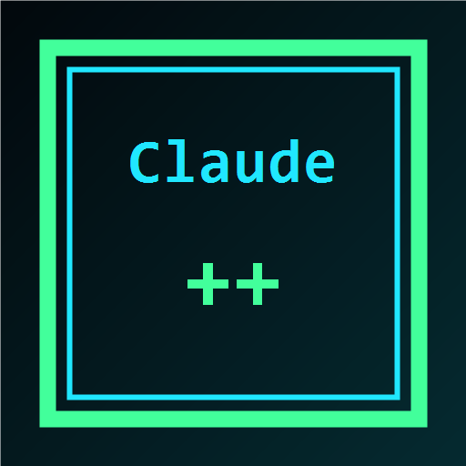

# ClaudeDesktopPlusPlus

<p align="center">
  
</p>

<p align="center">
  中文 | <a href="README_EN.md">English</a>
</p>

<p align="center">
  
  
  
  
  
  
  
</p>

ClaudeDesktopPlusPlus 是面向 Claude Desktop 的外部增强启动器和管理工具。它通过独立桌面控制台管理 Claude Desktop 的启动、第三方 API 配置、cc-switch 同步、插件能力、汉化资源、历史修复和系统就绪检查，目标是让 Claude Desktop 在开发者场景下更容易配置、更容易排查、更舒服地使用。

> 本项目不是 Anthropic 官方项目。Claude Desktop、Claude、Claude Code、Cowork 等名称和能力归其各自权利方所有。请只在你有权管理的本机环境中使用本工具。

## 快速使用

从 [GitHub Releases](https://github.com/2270525352/ClaudeDesktopPlusPlus/releases) 下载最新版安装包：

- Windows：`ClaudeDesktopPlusPlus-v*-windows-x64-setup.exe`
- macOS Apple Silicon：`ClaudeDesktopPlusPlus-v*-macos-arm64.dmg`
- macOS Intel：暂未发布，后续可单独补充 x64 DMG

安装后启动 `Claude++`，默认进入中文控制台。常用流程：

1. 在「系统就绪」里检查 Claude Desktop 是否为现代安装包版本。
2. 在「API 配置」里同步 `cc-switch` 或手动添加第三方 API。
3. 选择直连或 Gateway 模式，测试凭据和模型列表。
4. 在「能力插件」里同步官方插件目录，搜索并安装需要的插件。
5. 需要恢复本地记录时，进入「历史对话」点击一键修复。
6. 需要中文界面时，在顶部点击一键汉化，然后重启 Claude Desktop。

## 开发追踪

项目当前优先打磨 Claude Desktop Doctor & Launcher 的核心体验，推荐页暂不进入主流程。

查看详细规划：[ClaudeDesktopPlusPlus 开发追踪](docs/development-tracking.md)

## 交流与支持

欢迎通过下面的入口反馈问题、交流使用体验或提出新功能建议：

- GitHub Issues：<https://github.com/2270525352/ClaudeDesktopPlusPlus/issues>
- GitHub Releases：<https://github.com/2270525352/ClaudeDesktopPlusPlus/releases>
- GitHub Discussions：<https://github.com/2270525352/ClaudeDesktopPlusPlus/discussions>
- 邮箱：<a href="mailto:2270525352@qq.com">2270525352@qq.com</a>
- QQ 群：待开放
- 微信群：待开放

如果 ClaudeDesktopPlusPlus 帮到了你，欢迎给项目点一个 Star，或者在 Issue 里留下使用场景和改进建议。

## 主要功能

- Rust 后端 + Tauri 桌面壳，控制台不依赖浏览器页面运行。
- 中文优先 UI，支持中英文切换。
- cc-switch 配置同步，自动去重过期残留配置。
- 第三方 API Provider 管理，支持 Anthropic 兼容与 OpenAI / Codex 兼容两类协议。
- 直连模式与本地 Gateway 模式切换。
- OpenAI / Codex 兼容接口的模型发现、模型映射提示和兼容性检测。
- 一键启动 Claude Desktop，优先识别 Windows MSIX / modern installer。
- 系统就绪检查，显示 Claude 安装方式、VMP、Hypervisor、重启状态等信息。
- 官方插件市场同步，支持搜索、分页加载和安装。
- 一键汉化，通过资源补丁安装 zh-CN 文案，不默认修改 `app.asar`。
- 一键修复历史对话，自动选择可恢复来源并先备份当前 Claude-3p 数据。
- 项目说明和联系方式保留在 README / 关于页，不进入核心使用流程。
- 本地日志和状态提示，按钮操作结果会在当前页面即时弹窗展示。

## 痛点与解决

### 第三方 API 配置太散

Claude Desktop、cc-switch、第三方 API 平台通常各有一套配置方式，新用户很容易填错协议、Base URL、Key 或模型名。ClaudeDesktopPlusPlus 将这些入口收敛到「API 配置」页：

- 可从 `cc-switch` 同步已有配置。
- 可手动新增、编辑、删除第三方 API。
- 可测试凭据是否可用。
- 可根据 Base URL 和 Key 拉取模型列表。
- 可提示 OpenAI / Codex 兼容接口在直连模式下需要上游完成模型映射。

### 直连和 Gateway 边界不清楚

直连模式适合已经提供 Anthropic 兼容路由和模型映射的上游。Gateway 模式适合上游只有 OpenAI / Codex 兼容协议、需要本地转换请求的场景。

控制台会在总览页提示：

- OpenAI / Codex 协议想走直连，需要第三方平台提前做好模型映射。
- 如果模型映射不完整，建议使用 Gateway 兼容模式。
- Gateway 会提升兼容性，但也可能限制某些 Claude Desktop 的本地能力表现。

### Claude Desktop 安装方式不满足 Cowork 要求

Windows 上 Cowork / workspace 能力要求 Claude Desktop 使用现代安装器，并依赖 Virtual Machine Platform。ClaudeDesktopPlusPlus 的「系统就绪」页会检测：

- 当前 Claude Desktop 安装来源。
- MSIX AppUserModelID。
- Virtual Machine Platform 状态。
- Hypervisor Platform 状态。
- 是否需要重启。

工具提供一键安装 Claude Desktop modern installer 和一键启用 VMP 的入口。若 Windows 组件本身返回 DISM 错误，页面会展示原始日志，方便继续排查系统镜像、固件虚拟化或策略限制。

### 插件市场为空或不好找

Claude Desktop 内部组织插件列表可能受账号或组织策略影响。ClaudeDesktopPlusPlus 额外提供「能力插件」页，用 Claude 官方 CLI 同步官方插件目录，并在本机插件市场中搜索、分页和安装。

已支持的典型插件包括：

- `playwright`：浏览器自动化和页面测试。
- `github`：仓库、Issue、Pull Request 管理。
- `context7`：拉取版本化文档与代码示例。
- `frontend-design`：高质量前端界面生成辅助。
- `typescript-lsp`、`pyright-lsp`、`rust-analyzer-lsp` 等语言服务插件。

中文界面下会对常见插件名称和说明做本地化展示。

### 切换账号或渠道后历史对话丢失

Claude Desktop 的本地缓存可能分散在官方 profile、Claude-3p profile、MSIX 虚拟化目录等位置。ClaudeDesktopPlusPlus 提供「历史对话」页：

- 自动扫描本机可恢复来源。
- 自动选择最近且含有可恢复数据的来源。
- 修复前备份当前 Claude-3p 目标目录。
- 默认恢复聊天 IndexedDB、附件、本地 Agent 会话、Claude Code 会话。
- Local Storage / Session Storage 只扫描，不默认恢复，避免污染登录态。

## API 配置与模型映射

ClaudeDesktopPlusPlus 支持两类 Provider。

### Anthropic 兼容

适合已经提供 Claude / Anthropic 风格接口的上游。通常可以使用直连模式。

### OpenAI / Codex 兼容

适合 Codex、OpenAI 风格中转站。它们通常通过 `/v1/models`、`/v1/chat/completions` 或类似路由暴露模型。若要在 Claude Desktop 中直连使用，第三方平台需要提前把 Claude 模型名映射到真实上游模型，例如：

```text
claude-opus-4-5   -> gpt-5.5
claude-sonnet-4-5 -> gpt-5.4
claude-haiku-4-5  -> gpt-5.4-mini
```

如果上游不支持这种直连映射，请使用 Gateway 模式。Gateway 会在本机转换请求并转发到上游。

## 一键汉化

一键汉化会安装 zh-CN 资源文件并写入 Claude locale。当前策略是 Cowork 兼容的资源补丁：

- 不默认 patch `app.asar`。
- 会写入必要的 zh-CN JSON 资源。
- 可一键启用或停用。
- 启用后需要重启 Claude Desktop 才能完整生效。

汉化资源来自开源项目，授权和第三方说明保存在：

```text
assets/localization/zh-CN/
```

## 自动更新与安装包

ClaudeDesktopPlusPlus 通过 GitHub Release 发布安装包。当前发布目标：

- Windows x64：NSIS 安装程序。
- macOS Apple Silicon：DMG 安装包。

Release 页面：<https://github.com/2270525352/ClaudeDesktopPlusPlus/releases>

后续会继续补齐 macOS Intel、自动更新提示和更完整的签名流程。

## 数据位置

常见本地路径：

- Claude++ 配置：`%APPDATA%\Claude++`
- Claude++ 3P profile：`%LOCALAPPDATA%\Claude-3p`
- Claude 官方 profile：`%APPDATA%\Claude`
- cc-switch 配置：`%USERPROFILE%\.cc-switch`
- Claude CLI 插件目录：`%USERPROFILE%\.claude\plugins`
- Claude++ 构建产物：`apps/desktop/src-tauri/target/`

仓库不会提交用户 API Key、Claude 登录态、本地缓存、构建产物或安装包。

## 常见问题

### 为什么 OpenAI / Codex 配置直连后没有模型？

直连依赖上游提供 Claude Desktop 能识别的模型名和协议形态。如果第三方平台只提供 OpenAI / Codex 原生模型列表，需要在平台侧配置模型映射，或者改用 Gateway 模式。

### 为什么 Gateway 能通，但某些能力像本地模式？

Gateway 是本地协议转换层，能提升 API 兼容性，但不能替代 Claude 官方账号、组织权限或 Claude Desktop 内部能力检查。需要官方登录态的能力仍由 Claude Desktop 和账号策略决定。

### 为什么启用 VMP 失败？

如果 DISM 返回错误，通常不是按钮本身失败，而是系统组件、Windows 版本、固件虚拟化、组策略或系统镜像存在限制。请先确认 BIOS/UEFI 已开启虚拟化，并检查 Windows 功能组件是否完整。

### 为什么插件页显示官方目录，但 Claude Desktop 组织插件仍为空？

ClaudeDesktopPlusPlus 安装的是本机 Claude CLI 插件目录。Claude Desktop 内部组织插件列表仍可能由 Claude 账号、组织后台和官方策略控制。

### 历史修复会复制登录凭证吗？

默认不会。工具只恢复聊天 IndexedDB、附件和本地工作会话。Local Storage / Session Storage 会扫描用于诊断，但不会默认恢复。

### macOS 提示无法打开或已损坏怎么办？

当前 macOS 安装包未签名/未公证时，Gatekeeper 可能拦截。可以在终端执行：

```bash
sudo xattr -rd com.apple.quarantine /Applications/Claude++.app
```

执行后重新打开 `Claude++` 即可。

## 开发

前端脚本检查：

```powershell
node --check ui\cyber-console\app.js
```

Rust 检查：

```powershell
cargo +stable-x86_64-pc-windows-gnullvm check --target x86_64-pc-windows-gnullvm -q
```

启动桌面开发模式：

```powershell
cd apps/desktop
npm install
npm run dev
```

构建安装包：

```powershell
cd apps/desktop
npm run bundle
```

发布流程：

```powershell
git tag v0.1.42
git push origin v0.1.42
```

GitHub Actions 会在 tag 推送后自动构建 Windows 和 macOS Release 产物。

主要结构：

```text
apps/desktop/                 Tauri 桌面控制台
apps/desktop/src-tauri/       桌面后端命令、系统检测、插件、历史修复
crates/claude-plus-core/      安装探测、CDP、launcher、asar patch 原型
crates/claude-plus-launcher/  CLI 原型入口
ui/cyber-console/             控制台静态 UI
assets/inject/                注入脚本
assets/localization/          zh-CN 汉化资源
docs/                         研究笔记
```

## 友情链接

- [Codex++](https://github.com/BigPizzaV3/CodexPlusPlus)

## 说明

ClaudeDesktopPlusPlus 是外部增强工具。Claude Desktop 更新后，如果安装结构、配置格式、插件目录或内置能力策略变化，可能需要同步更新本项目的探测和适配逻辑。

## License

MIT License. See [LICENSE](LICENSE).
