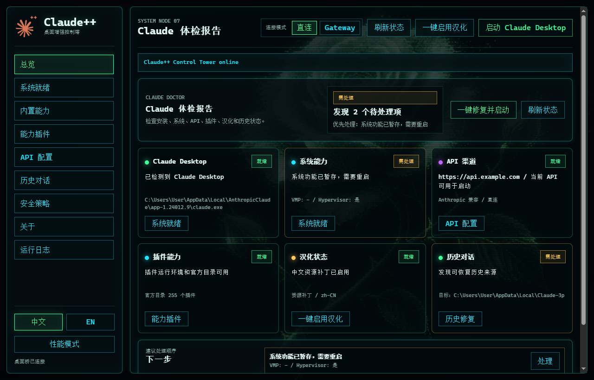
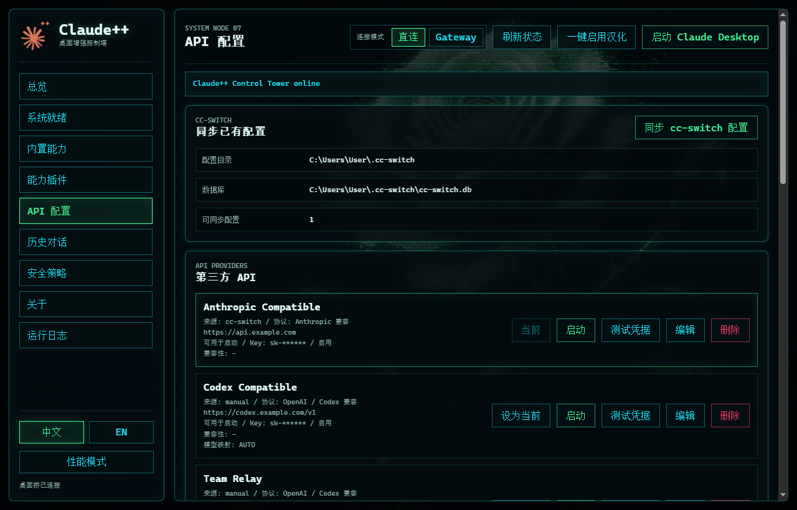
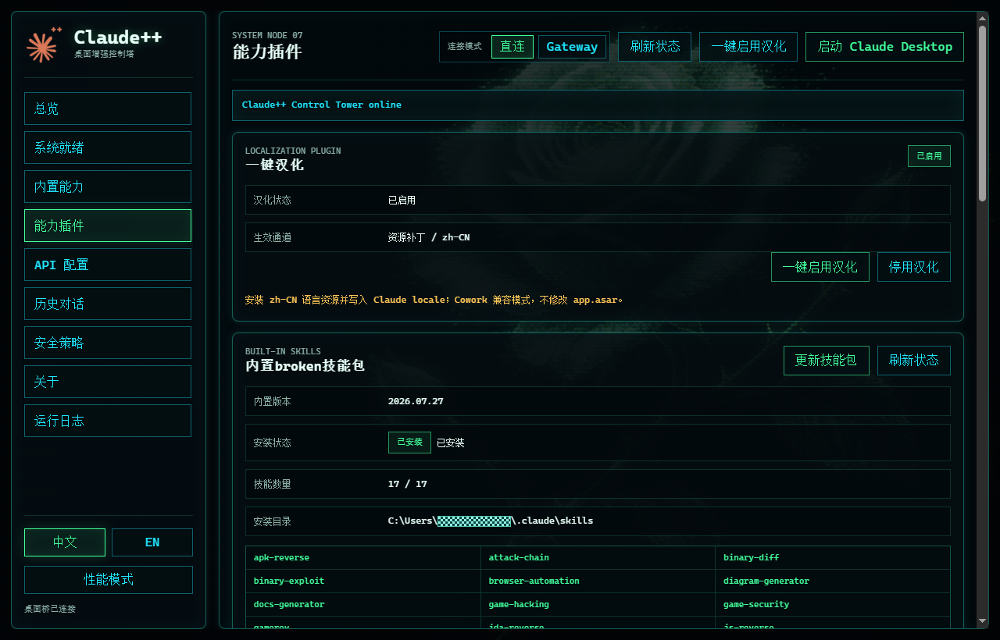

# ClaudeDesktopPlusPlus

<p align="center">
  
</p>

<p align="center">
  中文 | <a href="README_EN.md">English</a>
</p>

<p align="center">
  
  
  
  
  
  
  
</p>

ClaudeDesktopPlusPlus（Claude++）是面向 Claude Desktop 的第三方桌面增强工具。它把启动、第三方 API、`cc-switch`、插件、汉化、历史修复和系统检查集中到一个控制台中。

解决本地 Gateway 转发带来的能力限制，通过 Claude++ 一键配置第三方 API 直连；在 Claude 账号和系统环境满足要求时，解锁 Cowork 工作流。



## 主要功能

- 同步 `cc-switch`，管理 Anthropic 与 OpenAI / Codex 兼容 API。
- 在直连与本地 Gateway 之间切换，支持凭据测试和模型发现。
- 检测并启动 Claude Desktop，检查 Modern Installer、VMP 与 Hypervisor。
- 同步、搜索并安装 Claude 官方插件目录。
- 可随时安装、更新或安全卸载内置broken技能包，包含 17 个 Claude Code 技能。
- 一键汉化 Claude Desktop，一键修复切换账号或渠道后丢失的本地历史对话。
- 中英文界面、系统托盘、静默命令执行和应用版本检查。

<table>
  <tr>
    <td width="50%"></td>
    <td width="50%"></td>
  </tr>
  <tr>
    <td align="center">API 配置与 cc-switch 同步</td>
    <td align="center">插件、汉化与内置broken技能包</td>
  </tr>
</table>

## 下载

前往 [GitHub Releases](https://github.com/2270525352/ClaudeDesktopPlusPlus/releases) 下载：

- Windows x64：`ClaudePlus-Windows-x64-Setup.exe`
- macOS Apple Silicon：`ClaudePlus-macOS-arm64.dmg`
- macOS Intel：`ClaudePlus-macOS-x64.dmg`

安装后启动 `Claude++`，建议依次完成：

1. 在「系统就绪」检查 Claude Desktop。
2. 在「API 配置」同步或添加 Provider。
3. 测试凭据后选择直连或 Gateway。
4. 在「能力插件」安装所需插件和技能。

## 使用说明

- Anthropic 兼容 Provider 通常可直接连接。
- OpenAI / Codex 兼容 Provider 如需直连，第三方平台必须提供 Claude 可识别的协议和模型映射；否则使用 Gateway。
- Claude Desktop 的 Cowork、Code、组织插件等能力仍取决于真实 Claude 登录态和官方策略。
- 本地插件功能使用 Claude 官方 CLI 和官方插件目录，不等同于组织后台下发的插件。
- 历史修复会先备份当前目标数据，默认不会复制登录凭据。
- Windows 卸载程序会自动移除 Claude++ 写入的 3P 路由；也可在「API 配置」中手动恢复 Claude 官方配置。
- 本次兼容性与卸载恢复改动见 [v0.1.44 修复说明](docs/releases/v0.1.44-fixes.md)。
- `v0.1.45` 的发布内容见 [v0.1.45 发布说明](docs/releases/v0.1.45.md)。
- `v0.1.46` 已为 macOS ARM64 和 Intel x64 应用加入代码签名及 DMG 内签名校验，修复浏览器下载后提示应用损坏的问题。
- `v0.1.47` 使用简短安装包名称，并为 Windows/macOS 增加 Claude Desktop 自动版本检查与一键安装、更新。
- `v0.1.48` 修复官方最新版本重定向解析，并在应用启动后自动执行版本检查；检查失败时会直接显示错误状态。

## 开发

```powershell
cd apps/desktop
npm install
npm run dev
```

检查与构建：

```powershell
node --check ui\cyber-console\app.js
cargo +stable-x86_64-pc-windows-gnullvm test --target x86_64-pc-windows-gnullvm -q
cd apps/desktop
npm run bundle
```

详细进度见 [开发追踪](docs/development-tracking.md)。

## 反馈

- [Issues](https://github.com/2270525352/ClaudeDesktopPlusPlus/issues)
- [Releases](https://github.com/2270525352/ClaudeDesktopPlusPlus/releases)
- 邮箱：<a href="mailto:2270525352@qq.com">2270525352@qq.com</a>
- 参考项目：[Codex++](https://github.com/BigPizzaV3/CodexPlusPlus)

## License

[MIT License](LICENSE)
